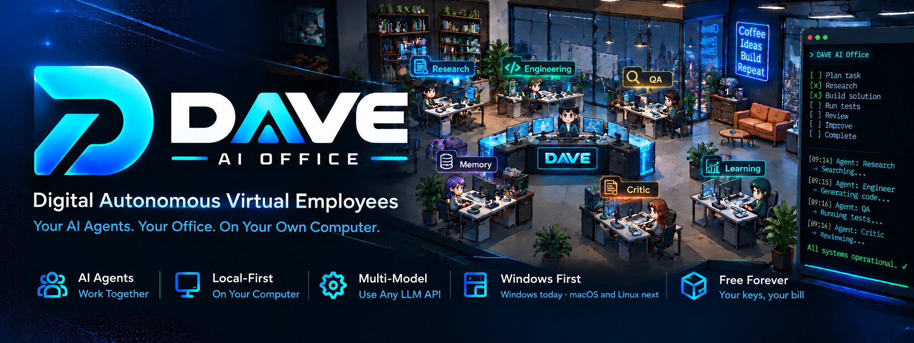
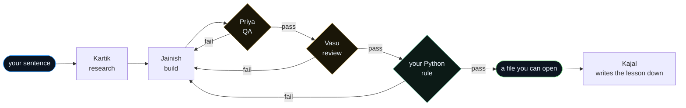

<div align="center">



<br>

### Digital&nbsp;·&nbsp;Autonomous&nbsp;·&nbsp;Virtual&nbsp;·&nbsp;Employees

**An office of AI employees that runs on your own computer.**

You give one sentence. Six specialists pass the work desk to desk — and you watch every handoff.

<br>

[](../../releases/latest)
[](https://YOURSITE.com/start.html)


</div>

---

<div align="center">

**[What it is](#what-it-is)** · **[How it works](#how-it-works)** · **[The floor](#the-floor)** · **[Memory](#memory-and-lessons)** · **[Brains](#three-ways-to-give-it-a-brain)** · **[Install](#install)** · **[Architecture](#architecture)** · **[Roadmap](#roadmap)**

</div>

---

## What it is

Most AI tools hand you one assistant and a wall of text, then ask you to trust
it. DAVE hands you a floor.

Six specialists sit at their own desks. You give one goal in a sentence. The
front desk works out how many people it takes, writes the brief, and hands it
out. They walk the work to each other — and the work is **checked, scored and
sent back for a revision** before it ever reaches you.

Everything runs on your machine, with the AI key you already have.

<br>

<table>
<tr>
<td width="25%" valign="top">

**You can audit it**

Who did what, what they passed on, what verdict came back, and what each step
cost in tokens. Pause mid-job and carry on later.

</td>
<td width="25%" valign="top">

**Your rules, in code**

Twelve lines of Python, and your rule checks every build for ever — free, no
tokens, in its own process.

</td>
<td width="25%" valign="top">

**It learns your work**

Lessons from finished jobs feed into the next ones. A lesson followed by three
failures retires itself.

</td>
<td width="25%" valign="top">

**It will not invent**

No key, no answer. A file cut off halfway fails rather than arriving broken.

</td>
</tr>
</table>

---

## How it works



Three loops back to the builder. Weak work never reaches you as a first draft.

**What that looks like**

```console
$ build a booking page for my restaurant                    effort: deep

  ●  Kartik    gathered findings                             3,712 tokens
  ●  Jainish   wrote index.html  (4.1 KB)                   11,796 tokens
  ●  Priya     checked it point by point     VERDICT: pass   9,589 tokens
  ●  Vasu      scored it 9/10 · one fix wanted               9,488 tokens
  ●  Dev       ran your Python  VERDICT: fail  no <footer>       0 tokens
  ●  Jainish   fixed it and saved again  (4.6 KB)           18,337 tokens
  ●  Puja      kept 1 note for next time                     2,084 tokens

  ✓ index.html saved  ·  7 steps  ·  3 verdicts  ·  the office is free again
```

**Effort is yours to set.** *Quick* sends one specialist. *Deep* always runs
research, QA and review. *Auto* lets the front desk decide.

---

## The floor

```
   ┌──────────┐  ┌──────────┐  ┌──────────┐  ┌──────────┐  ┌──────────┐
   │  KARTIK  │  │ JAINISH  │  │  PRIYA   │  │   VASU   │  │   PUJA   │
   │ research │  │  build   │  │    QA    │  │  review  │  │  memory  │
   └────┬─────┘  └────┬─────┘  └────┬─────┘  └────┬─────┘  └────┬─────┘
        │             │             │             │             │
        └─────────────┴──────┬──────┴─────────────┴─────────────┘
                             │
                      ┌──────┴──────┐
                      │    DAVE     │   ← one sentence in
                      │ front desk  │
                      └─────────────┘
```

A live 2D office. Agents walk to each other to hand work over, and the status
cards below show what each desk is doing right now.

### The six who clock in

| | Desk | What they do |
|---|---|---|
|  | **Kartik** · Research | Finds out what the job needs before anyone builds |
|  | **Jainish** · Engineering | Writes the code, the page, the document |
|  | **Priya** · QA | Checks the work against the request, point by point |
|  | **Vasu** · Review | Scores it out of ten and names the fix |
|  | **Puja** · Memory | Keeps what will still matter in a month |
|  | **Kajal** · Learning | Turns finished jobs into rules for the next one |

**Ten desks in all.** Hire whoever you need — give them a name, a role, a
colour and a brain.

---

## Write a rule once. It checks every build for ever.

```python
def check(request: str, work: str) -> tuple[bool, str]:
    """Every page this office builds must have a footer."""
    if "<footer" not in work.lower():
        return False, "no <footer> element in the page"
    return True, "footer present"
```

No tokens. Runs in its own process, so a mistake in your code is **reported and
skipped**, never a job that hangs. Or describe the rule in plain English and let
an agent judge it — both work, and you can mix them.

---

## Memory and lessons

Two different things, deliberately.

**Memory** is what the office knows about *you and your work*. The knowledge
keeper files what will still matter in a month and throws the rest away. Plain
files you can read, edit or delete.

**Lessons** are what the office learned about *doing the job*. After a task
ends, the learning lab writes down what worked and what failed as a rule. Those
rules are fed into similar tasks later — and a lesson followed by **three
failures and no successes retires itself**, so a bad rule cannot quietly rot
the office.

The office you use next month is not the one you installed.

**Your own folders too.** Point DAVE at a folder on your disk and it reads the
text and PDFs once, keeps a small index beside your data, and answers questions
from it. Nothing is uploaded. Images and scanned PDFs are listed and honestly
marked unreadable.

---

## Three ways to give it a brain

DAVE sells no tokens, so it can never mark them up.

<table>
<tr>
<td width="33%" valign="top">

### 1 · One key, everyone

Paste a single API key and the whole floor uses it.

Most people start here and stay.

</td>
<td width="33%" valign="top">

### 2 · One brain per role

A strong model for building, a cheap fast one for QA and memory.

The bill drops; the quality doesn't.

</td>
<td width="33%" valign="top">

### 3 · Every desk its own

Any agent can have its own provider, model, tool or key.

Your paid tool on the builder, a free key everywhere else.

</td>
</tr>
</table>

> **The rule:** the desk wins over the role, and the role wins over the office.
> One change never breaks the rest.

### What it works with

| | |
|---|---|
| **API keys** | Google Gemini · OpenAI · Anthropic · any OpenAI-compatible endpoint |
| **On your machine** | Ollama — no key, no bill, never busy |
| **Tools you already pay for** | Tell DAVE where the program lives and what to run. Nothing is hard-coded, so a new tool works without a new version of DAVE. |

**Backups, in your order.** Name two or three spare models. If yours is busy or
out of quota, DAVE waits, retries, then moves down your list — and tells you
which limit it hit.

**A budget per agent.** Cap what any desk may spend. Hit the cap and that agent
stops and says so, instead of quietly running up your bill.

---

## Install

<table>
<tr><td width="52" align="center"><b>01</b></td><td>

Download **[DAVE-Setup-v1.0.0.exe](../../releases/latest)**

</td></tr>
<tr><td align="center"><b>02</b></td><td>

Run it. Windows shows a SmartScreen warning because the app is not code-signed
yet — click **More info**, then **Run anyway**

</td></tr>
<tr><td align="center"><b>03</b></td><td>

Open the app. Setup asks you to accept the terms, choose what the office may do,
paste a key, and pick a folder for your agents' work

</td></tr>
<tr><td align="center"><b>04</b></td><td>

Give it a task. Watch the floor, or open the console for the detail

</td></tr>
</table>

About five minutes, and the first task costs nothing on a free key.

**What it needs** — Windows 10 or 11, 64-bit, and one brain from the table
above. There is no account, and there will not be one.

### Where things live

| What | Where |
|---|---|
| Settings, keys, memories, logs | `%APPDATA%\DAVE AI Office` |
| What your agents produce | the folder you pick during setup |

Uninstalling removes the app. **Your work stays where you put it** until you
delete it yourself.

---

## Run it

Once the office is open:

| | |
|---|---|
| **floor** | Dispatch a task. Choose an owner, the effort, a playbook, and attach files |
| **work** | Every task, every step, every verdict and every token |
| **output** | What the agents produced — open it, download it, delete it |
| **brains** | Which engines are on this machine, and the API keys |
| **roles** | Your own roles, in English or in Python, with a test button |
| **map** | The traffic on the floor: who handed what to whom, and who is busy now |
| **knowledge** | What the office remembers, and the folders it has read |
| **schedule** | Jobs that run on their own — a morning brief at 08:00, say |
| **console** | The terminal, for anyone who prefers typing |

**Drag files onto the office** to attach them to the next task. Text, code, CSV
and PDF are read; anything else is listed and honestly marked unreadable.

---

## Private because of how it is built

```
    your machine                                     the provider you chose
  ┌───────────────────────────────┐                 ┌──────────────────────┐
  │  tasks · files · memories     │                 │                      │
  │  keys, in an encrypted vault  │ ───────────────▶│   your prompt only   │
  │  logs · lessons · the office  │                 │                      │
  └───────────────────────────────┘                 └──────────────────────┘

                        no server of ours, anywhere in that line
```

No account. No sign-in. No telemetry. No analytics. No crash reporting.

You can confirm it: the only outbound requests are to the provider endpoint
shown in your own settings. With a local model through Ollama, **nothing leaves
your machine at all**.

---

## Architecture

```
  ┌─────────────────────────────────────────────────────────────┐
  │  Desktop window  ·  pywebview, using the system's webview   │
  ├─────────────────────────────────────────────────────────────┤
  │  Interface  ·  React + TypeScript + Vite                    │
  │     the office floor · the command centre · the map         │
  ├────────────────────────────┬────────────────────────────────┤
  │        REST + WebSocket    │        live events             │
  ├────────────────────────────┴────────────────────────────────┤
  │  Backend  ·  Python + FastAPI                               │
  │                                                             │
  │   orchestrator ── plans the job, runs the relay, retries    │
  │   agents ─────── the roster, each with its own brain        │
  │   roles ──────── your Python, in a separate process         │
  │   providers ──── keys, models, backups, cooldowns           │
  │   engines ────── coding tools found on this machine         │
  │   memory ─────── what the office knows                      │
  │   learning ───── what the office learned                    │
  │   library ────── files, folder indexes, playbooks, reports  │
  │   credentials ── the encrypted vault                        │
  └─────────────────────────────────────────────────────────────┘
                              │
                     plain files on your disk
              no database · nothing you cannot read
```

**No database.** Everything is JSON and Markdown on your own disk. You can open
any of it in a text editor, back it up by copying a folder, and delete it by
deleting a folder.

**Three jobs at once**, ten desks. Sized for one person's real work, so your
laptop stays usable while the office runs.

---

## Roadmap

| | | |
|---|---|---|
| ✅ | **1.0 — the office** | Live floor, the relay, QA and review, programmable roles, memory, lessons, reports, the map |
| ◐ | **1.1 — polish** | Update notifications, a settings panel, the data folder movable after setup |
| ○ | **macOS and Linux** | The code is already cross-platform; the installers are the work |
| ○ | **More formats** | Word and Excel, read and written properly |
| ○ | **Pro — always on** | A cloud office that keeps working with your PC switched off, opt-in per job |
| ○ | **Pro — on your phone** | Send a job from anywhere, read the result later |
| ○ | **Teams** | Each person keeps their own office and their own keys; the offices pass work between themselves |

Dates are deliberately absent. They would be guesses.

---

<details>
<summary><b>What it does not do — and why</b></summary>

<br>

Every one of these is a choice or a date, not a surprise.

- **Windows only for now.** One platform tested properly beats three done
  badly. macOS and Linux run from source today; packaged builds are next.
- **It runs while your PC is on.** That is exactly what keeps your work on your
  own machine. The cloud office is being built for people who need it round the
  clock.
- **It reads text, code, CSV and PDF.** Word and Excel are on the list. Until
  then it says so plainly rather than half-reading them.
- **It cannot write .pptx, .docx or .xlsx directly.** It delivers a script that
  makes the file, and tells you that is what it did.
- **It says "I can't read images" instead of guessing.** A wrong description of
  your photo is worse than an honest no.
- **Agents search, they do not roam.** The researcher searches when you allow
  it. Nothing clicks around the internet on your behalf.
- **The model you pick decides the quality.** DAVE shows you exactly what each
  one produced and what it cost, so you can choose well.
- **English interface for now.** Every word is a plain string, so translations
  are welcome.

</details>

<details>
<summary><b>Something broken?</b></summary>

<br>

Open an issue with **what you did** and **what you saw**. That is worth hours.

The log is at `%APPDATA%\DAVE AI Office\dave.log` — the last twenty lines
usually say what happened.

**Known first-run notes**

- Windows SmartScreen warns about any unsigned installer. Click **More info**,
  then **Run anyway**.
- Some antivirus software flags freshly built Python apps. If yours does, say
  so in an issue and I will add a hash you can check.
- Free provider tiers have daily limits. If tasks stop working after several
  deep jobs, that is your provider's cap, not DAVE.

</details>

---

## Licence and ownership

Created and maintained by **Dhruvil Dave**. Full terms in
**[LICENSE.txt](LICENSE.txt)**.

- **Use it freely**, for personal or commercial work, on as many of your own
  machines as you like.
- **What it makes is yours.** Output produced with your keys belongs to you; we
  claim nothing in it.
- **Please do not** resell the app as your own product, or reuse the artwork,
  logo or name in a way that suggests we made or endorsed your version.

The artwork, the characters, the logo, the wordmark and the names *DAVE* and
*DAVE AI Office* stay with the author.

**About the artwork.** The office was made for this project — no tileset, no
asset pack, no stock library. The characters are not images at all: they are
drawn by code, shape by shape, while the app runs. The project contains no
sprite sheet.

---

## Built with

Open source that made this possible, each under its own licence:

**Backend** — [FastAPI](https://fastapi.tiangolo.com) ·
[Starlette](https://www.starlette.io) · [Uvicorn](https://www.uvicorn.org) ·
[httpx](https://www.python-httpx.org) · [Pydantic](https://pydantic.dev) ·
[cryptography](https://cryptography.io) · [pypdf](https://pypdf.readthedocs.io) ·
[pywebview](https://pywebview.flowrl.com) ·
[PyInstaller](https://pyinstaller.org)

**Interface** — [React](https://react.dev) ·
[TypeScript](https://www.typescriptlang.org) · [Vite](https://vite.dev) ·
[Zustand](https://zustand-demo.pmnd.rs)

**Installer** — [Inno Setup](https://jrsoftware.org/isinfo.php)

AI providers and coding tools named in this project are the property of their
owners. DAVE works with them; it is **not affiliated with, endorsed by, or a
product of** any of them.

---

<div align="center">

<br>

# Open your office tonight.

### Six specialists are already at their desks, waiting for a job.

<br>

<a href="../../releases/latest">
  
</a>
<br>

# **© 2026 Dhruvil Dave · Runs on your computer · Your keys, your bill, your data**

</div>
